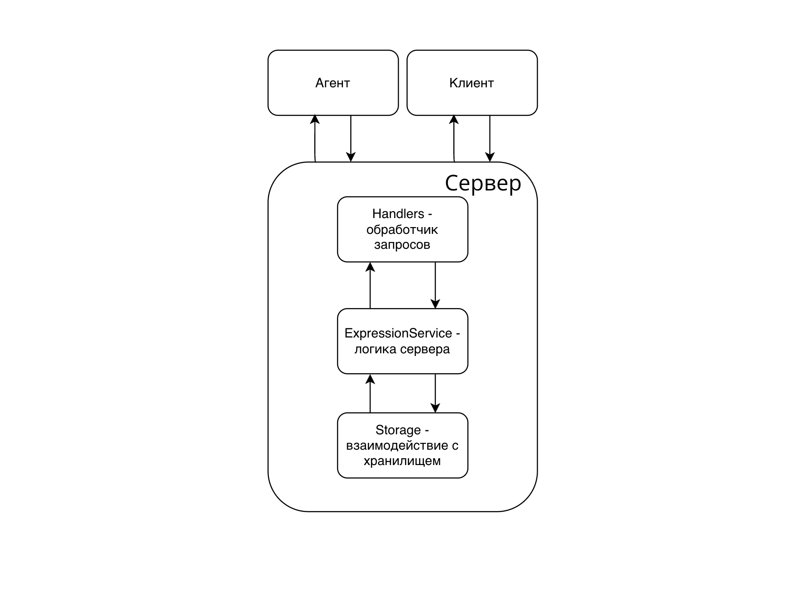

# Распределённый вычислитель арифметических выражений
Сервис подсчёта арифметических выражений, а теперь еще и с параллельными вычислениями!

## Описание
Проект предоставляет два сервиса: оркестратор и агент. Они работают вместе и решают арифметические уравнения. Оркестратор парсит уравнения на независимые подзадачи, а агент вычисляет их параллельно.

## Инструкция по запуску
1. Клонируйте репозиторий
```bash
git clone https://github.com/Yshariale/FinalTaskFirstSprint
cd calc_api_go
```
2. По желанию сконфигурируйте проект. Создайте файл `.env` и скопируйте в него содержимое `.env.example`:
```bash
cp .env.example .env
```
По умолчанию будут установлены значения:
```
PORT=8080
TIME_ADDITION_MS=1000
TIME_SUBTRACTION_MS=1000
TIME_MULTIPLICATIONS_MS=1000
TIME_DIVISIONS_MS=1000
COMPUTING_POWER=10
TASK_URN=/internal/task # не трогать
```
3. Запустите оркестратор
```bash
go run cmd/orchestrator/main.go
```
4. Запустите агента
```bash
go run cmd/agent/main.go
```
## Инструкция по использованию

1. На `/api/v1/calculate` присылаете выражение:
```
curl --location 'localhost:8080/api/v1/calculate' \
--header 'Content-Type: application/json' \
--data '{
  "expression": "2+2"
}'
```
В ответ получаете id:
```
{"id":1}
```
2. Затем посылаете запрос на `/api/v1/calculate/{id}'`
```
curl --location 'localhost:8080/api/v1/expressions/1'
```
И ждете пока сервер не решит невероятно трудозатратную задачу
```
{
    "id": 1,
    "status": "solve",
    "result": 4
}
```

## Примеры запросов и ответов
* ### /api/v1/calculate
| Запрос | Код |Ответ | Описание |
|-|-|-|-|
| `curl --location 'localhost:8080/api/v1/calculate' --header 'Content-Type: application/json --data '{"expression": "2+2"}'` | 200 | `{"id":1}` | Присылаете выражение и получаете id|
|`curl --location 'localhost:8080/api/v1/calculate' --header 'Content-Type: application/json' --data '{"expression": "2+2*2)"}'`|422|`{"error":"mismatched bracket"}`|Указывает на неправильную скобочную последовательность|
|`curl --location 'localhost:8080/api/v1/calculate' --header 'Content-Type: application/json' --data '{"expression": "2+2*a"}'`|422|`{"error":"invalid symbols"}`|Указывает на некорректные символы в выражении|
|`curl --location 'localhost:8080/api/v1/calculate' --header 'Content-Type: application/json' --data '{"expression": "2++2"}'`|422|`{"error":"invalid operations placement"}`|Указывает на некорректную расстановку арифметических операций|
|`curl --location 'localhost:8080/api/v1/calculate' --header 'Content-Type: application/json' --data '{"expression": "2/0"}'`|200|`{"id":1}`|На этапе отправки деление на ноль не проверяется, но в итоге появится ошибка в статусе выражения|
|`curl --location 'localhost:8080/api/v1/calculate' --header 'Content-Type: application/json' --data '{"expression": "2/0"}'`|422|`{"error":"invalid expression"}`|Пустое выражений|
|`curl --location 'localhost:8080/api/v1/calculate' --header 'Content-Type: application/json' --data ''`|400|`{"error":"invalid request"}`|Отсутствие тела запроса|
|`curl --location 'localhost:8080/api/v1/calculate'`|405|-|Метод не разрешен|

* ### /api/v1/expressions
| Запрос | Код |Ответ | Описание |
|-|-|-|-|
|`curl --location 'localhost:8080/api/v1/expressions'`|200|`[{"id": 1,"status": "error division by zero","result": 0}]`|Список всех выражений, но одно завершилось с ошибкой|
|`curl --location 'localhost:8080/api/v1/expressions'`|200|`[]`|Список оказался пуст|
* ### /api/v1/expressions/:id
| Запрос | Код |Ответ | Описание |
|-|-|-|-|
|`curl --location 'localhost:8080/api/v1/expressions/1`|200|`{"id": 1,"status": "solve","result": 4}`|Успешное завершение уравнения|
|`curl --location 'localhost:8080/api/v1/expressions/2`|200|`{"id": 2,"status": "error division by zero","result": 0}`|Ошибка деления на ноль отлавливается здесь|
|`curl --location 'localhost:8080/api/v1/expressions/876`|404|`{"error":"expression not found"}`|Несуществующее уравнение|
|`curl --location 'localhost:8080/api/v1/expressions/abc`|404|`404 page not found`|Несуществующая страница|
* ### /internal/task
| Запрос | Код |Ответ | Описание |
|-|-|-|-|
|`curl --location 'localhost:8080/internal/task`|200|`{"id":2, "arg1":2, "arg2":0, "operation":"/", "operation_time":100}`|Выдана задача|
|`curl --location 'localhost:8080/internal/task`|404|`{"error":"no tasks available"}`|Свободных задач нет|
|`curl --location 'localhost:8080/internal/task --header 'Content-Type: application/json' --data '{"id": 2, "result": 0}'`|200|-|Задача принята|
|`curl --location 'localhost:8080/internal/task --header 'Content-Type: application/json' --data ''`|422|`{"error":"invalid body"}`|Некорректное тело запроса|

## Структура проекта
На диаграмме видно, что сервер состоит из 3 слоев, которые взаимодействуют только со своим соседом.

```
calc_api_go
├── agent
├── cmd
└── internal
    ├── application
    ├── config
    ├── models
    ├── services
    ├── storage
    └── transport
```

Описание директорий:
* `transport` — обработчики запросов
* `services` - логика сервера
* `storage` - взаимодействие с хранилищем

В коде вы найдете подробные комментарии

## Тесты
Каждый модуль в проекте покрыт тестами в большей или меньшей степени, но положительные тесты есть везде.

Чтобы запустить тесты перейдите в корневую директорию проекта и выполните команду
```bash
go test -v ./...
```

## Логи
Логи оркестратора будут хранится в файле `logs.txt`. В логах содержится информация о работе сервера, ошибках и сбоях. Сейчас каждый чих сервера логируется, это нужно для дебага.

Логи агента выводятся в терминал.
